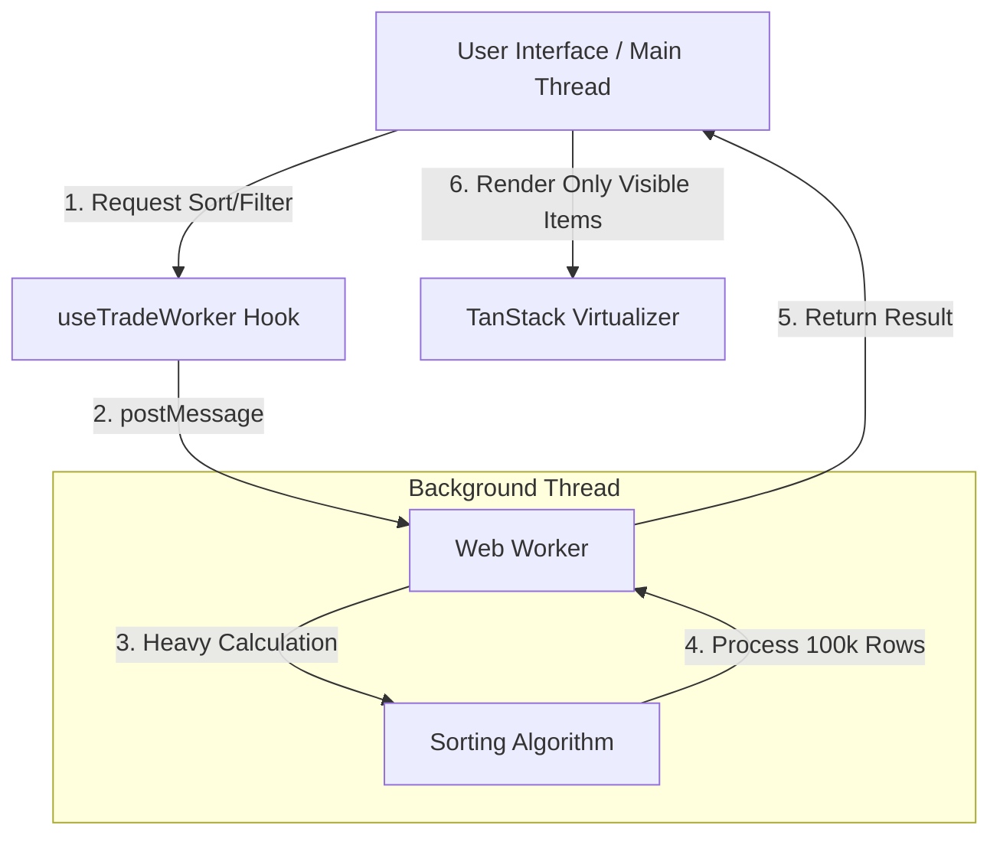

# ⚡ High-Frequency Data Grid (100k+ Rows)


-61DAFB?style=for-the-badge&logo=react&logoColor=black)


<!-- 
TIP: Replace the link below with a screen recording (GIF) of your app 
showing smooth scrolling and sorting with 100k rows. 
-->


> **A proof-of-concept for handling massive datasets in the browser without blocking the main thread.**
> 
> This project demonstrates how to render and manipulate **100,000+ live data points** while maintaining a steady **60 FPS**, utilizing Web Workers for heavy computations and Windowing (Virtualization) for DOM optimization.

---

## 🏗 Architecture Overview

Traditional dashboards freeze when sorting or filtering large arrays because JavaScript is single-threaded. This project solves those bottlenecks by implementing an **Off-Main-Thread Architecture**.


## 🚀 Key Features

*   **Zero UI Blocking:** All heavy lifting (generating data, sorting, filtering) happens in a dedicated `Web Worker`. The UI remains responsive (clickable/scrollable) even during complex calculations.
*   **Virtualization:** Uses `@tanstack/react-virtual` to render only the DOM nodes currently in the viewport. This keeps memory usage low, regardless of whether there are 1,000 or 1,000,000 rows.
*   **React 19 & Next.js 16:** Built on the bleeding edge, utilizing the new **React Compiler** for automatic optimization.
*   **Typed Web Workers:** Full TypeScript support for worker messages (no `any` types), ensuring type safety across the thread boundary.

## 🛠 Tech Stack & Decisions

| Technology | Purpose | Why? |
| :--- | :--- | :--- |
| **Next.js 16 (App Router)** | Framework | Leveraging the latest SSR and React Server Components features. |
| **Web Workers** | Parallelism | To offload CPU-intensive tasks from the main thread to prevent UI jank. |
| **TanStack Virtual** | Windowing | To render massive lists efficiently by maintaining a constant number of DOM elements. |
| **Tailwind CSS** | Styling | For rapid, utility-first styling with zero runtime overhead.

## 📂 Project Structure

A feature-based architecture designed for scalability (no nested `src` folder, following Next.js 16 recommendations).

```text
├── app/
│   ├── components/      # UI Components (VirtualGrid, etc.)
│   ├── hooks/           # Custom Hooks (useWorker logic encapsulation)
│   ├── page.tsx         # Main entry point
├── workers/             # The brain of the operation
│   └── data.worker.ts   # Dedicated worker for data processing
├── lib/
│   └── utils.ts
└── tailwind.config.ts
```
## 🧠 Technical Deep Dive

### 1. The Web Worker Pattern
Instead of putting the sorting logic inside a `useEffect`, we instantiate a Worker. This allows us to process 100k arrays without a single frame drop.

```typescript
// workers/data.worker.ts
self.onmessage = (e) => {
  const { type, payload } = e.data;
  if (type === 'SORT') {
    // This heavy loop happens in a background thread
    const sorted = sortData(payload); 
    self.postMessage({ type: 'DATA_UPDATED', payload: sorted });
  }
};
```

### 2. React Compiler & Virtualization
Since this project uses **React 19**, the compiler automatically memoizes components. However, strictly mutable libraries like `TanStack Virtual` (which manipulate refs directly for scroll performance) are intentionally skipped by the compiler to prevent stale UI states.

> *Note: You might see an ESLint warning regarding `incompatible-library` for `useVirtualizer`. This is expected and explicitly handled.*

## 🚦 Getting Started

First, run the development server:

```bash
npm install
npm run dev
```

Open [http://localhost:3000](http://localhost:3000) with your browser.

## 🤝 Contribution

This repository serves as a portfolio piece demonstrating advanced frontend performance techniques. Feel free to explore the code to see how modern React patterns can solve enterprise-level performance issues.

---
**Developed by [Negin Shafaei](https://www.linkedin.com/in/negin-shafaei/)**
